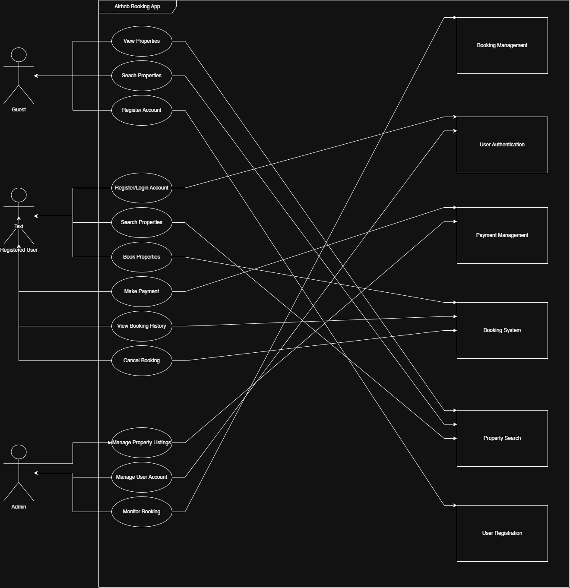

# Requirement Analysis in Software Development.

## Introduction
This repository has been created to document and demonstrate the process of __Requirement Analysis__ in the context of software development. It serves as a structured guild for understanding how requirements are gathered, analyzed, modeled, and validated before the design and implementation phases begin.

The purpose of this repository is to illustrate how effective requirement analysis forms the foundation of a successful software project. By using a practical **Booking Management System** as a case study, the repository highlights key concepts, methodologies, and deliverables associated with this critical stage of the __Software Development Lifecycle (SDLC).

Within this repository, you will find detailed explanations of the different stages and activities involved in requirement analysis, including requrement gathering, documentations, and validation. It also explores the classification of requirements, and provides a visual representation through use case diagrams, and concludes with examples well-defined acceptance criteria.

This resource is intended for **students, software engineers, and analysts** who seek to strengthen their understanding of requirement engineering practices and learn how to translate stakeholder needs into actionable software specifications.

### What is Requirement Analysis?
Requirement Analysis is a critical phase in the software development lifecycle (SDLC) where the project team gathers, analyzes, and defines the requirements of the software product to be developed. This process ensures that all stakeholders have a clear and mutual understanding of what the system should do and how it should perform.

### Why is Requirement Analysis Important?
Requirement Analysis is one of the most critical stages in the **Software Development Lifecycle (SDLC)** because it lays the groundwork for every subsequent activity. Without a precise understanding of what needs to be built, even the most skilled development team can deliver a solution that fails to meet user expectations or business objectives.

#### Critical Reasons Why Requirement Analysis is Important 
- **Clarity and Understanding:** It helps in understanding what the stakeholders expect from the software, reducing ambiguity.
- __Scope Definition:__ Clearly defines the scope of the project, which helps in preventing scope creep.
- __Basis for Design and Development:__ Provides a solid foundation for designing and developing the system.
- **Cost and Time Estimation:** Facilitates accurate estimation of project cost, resources, and time.
- **Quality Assurance:** Ensures that the final product meets the specified requirements, leading to higher customer satisfaction.

### Key Activities in Requirement Analysis.
Requirement Analysis involves a systematic set of activities that help teams understand, define, and validate what a software system must accomplish. Each activity builds upon the previous one, ensuring that requirements are accurate, feasible, and aligned with stakeholder needs. Below are the five key activities involved in this process:

* **Requirement Gathering**
This is the initial phase where the project team collects information from stakeholders, users, and other relevant sources. Techniques such as interviews, surveys, document analysis, and observation are used to understand user needs and business objectives. The goal is to capture as much relevant information as possible before refining it into structured requirements.
* **Requirement Elicitation**
Elicitation focuses on uncovering the real needs behind stakeholder requests. It goes beyond what users say they want to identify what they truly need. This step often involves brainstorming sessions, workshops, and use case analysis to reveal hidden or conflicting requirements that may impact the system’s design or functionality.
* **Requirement Documentation**
Once requirements are gathered and clarified, they are formally documented to serve as a reference for all project stakeholders. Clear and well-structured documentation—often in the form of a Software Requirements Specification (SRS)—ensures that everyone involved understands the system’s scope, objectives, and constraints. Proper documentation also supports future maintenance and updates.
* **Requirement Analysis and Modeling**
In this stage, the collected requirements are analyzed for consistency, completeness, and feasibility. The team identifies dependencies, prioritizes features, and models requirements using diagrams such as data flow diagrams (DFDs), entity-relationship diagrams (ERDs), or use case diagrams. This helps visualize system behavior and relationships, making it easier to communicate complex concepts to both technical and non-technical stakeholders.

* **Requirement Validation**
Validation ensures that the documented requirements accurately represent stakeholder intentions and are achievable within technical and budgetary limits. Techniques like reviews, walkthroughs, and prototyping are used to confirm that each requirement adds value to the project. This step acts as a final checkpoint before design and development begin, reducing costly rework later in the SDLC.

In essence, these five activities work together to bridge the gap between business needs and technical solutions. They create a shared understanding of the project vision, ensuring that the final product is not just functional, but truly fit for purpose.

### Types of Requirements.
In software development, requirements are broadly categorized into __Functional Requirements__ and **Non-functional Requirements**. Understanding both types is essential to ensure that the system not only performs the right tasks but also performs them effectively and reliably.

#### Functional Requirements
Functional requirements describe what the system should do. They define the specific functions, behaviors, and operations of the software that directly support user needs and business goals. Essentially, they represent the “features” of the system.

For the Booking Management System, examples of functional requirements include:

- **User Registration and Authentication:** The system should allow users to create an account, log in securely, and manage their profiles.

- **Booking Creation:** Users should be able to search available services or rooms, select dates, and confirm bookings.

- **Payment Processing:** The system should enable users to make payments via multiple options such as credit card, debit card, or digital wallets.

- **Booking Cancellation and Modification:** Users should be able to modify or cancel bookings according to the organization’s policies.

- **Admin Management:** Administrators should be able to view all bookings, manage users, and update service availability.

Functional requirements serve as the foundation for system design, helping developers understand the scope of functionality needed to meet user expectations.

#### Non-functional Requirements
Non-functional requirements describe how the system should perform. They focus on the quality attributes of the system, such as performance, reliability, usability, and security. While they don’t define specific features, they ensure the system operates efficiently and delivers a positive user experience.

For the Booking Management System, examples of non-functional requirements include:

- __Performance:__ The system should process booking requests within 3 seconds under normal load conditions.

- __Security:__ All user data must be encrypted during storage and transmission using industry-standard protocols (e.g., HTTPS, AES).

- __Availability:__ The system should be accessible 24/7 with a minimum uptime of 99.5%.

- __Usability:__ The interface should be intuitive and responsive across devices, enabling users to complete a booking in fewer than five steps.

- __Scalability:__ The system should support increasing numbers of concurrent users without performance degradation.

Non-functional requirements are critical to ensuring the stability, efficiency, and long-term success of the software. Without them, even a feature-rich system may fail to meet user satisfaction or operational standards.

Together, functional and non-functional requirements form the **blueprint of a successful software system**. Functional requirements define what the system does, while non-functional requirements ensure it does those things well. Both must be analyzed and documented carefully during the **Requirement Analysis phase** to achieve a high-quality, user-centered product.

### Use Case Diagrams.
Use Case Diagrams are a vital component of the Requirement Analysis process. They visually represent the interactions between **users (actors)** and the **system**, helping both developers and stakeholders understand how the software will function from a user’s perspective.

In the context of a **Booking Management System**, the use case diagram identifies the main actors and the primary functions they perform within the system. This visualization simplifies communication, ensures alignment between teams, and provides a foundation for designing user stories and system workflows.

1. **Actors in the System**

The primary actors for the Booking Management System include:

- **Guest:** The end user who is not yet registered/authenticated but interacts with the system with limitations to search, and view bookings only.

- **Registered User:** The end user who is registered/authenticated and interacts with the system to search, book, pay and manage reservations. 

- **Administrator:** Responsible for managing user accounts, system configurations, and monitoring bookings.

2. **Key Use Cases

The essential use cases for the system include:

- **Register / Login:** Enables customers to create and access their accounts.

- **Search Availability:** Allows users to view available rooms, services, or events.

- **Make a Booking:** Facilitates the reservation process by confirming selected dates and services.

- **Make Payment:** Integrates with the payment gateway to process transactions securely.

- **View / Modify / Cancel Booking:** Enables users to manage their bookings according to established policies.

- **Manage System (Admin):** Allows administrators to view all transactions, update listings, and handle system maintenance tasks.

3. **Visual Representation

Below is the use case diagram representing these interactions. The image can be created using tools like Draw.io, Lucidchart, or Creately, then exported and embedded into the repository.

